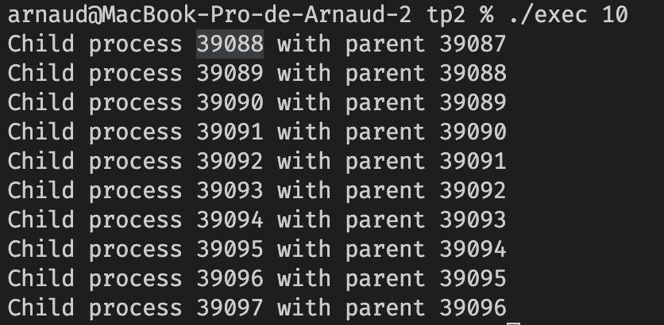

# Compte Rendu de TP 2 de système

## Question 1 : Fonction créant une chaine de n processus

J’ai fais une fonction récursive en veillant à afficher un message d’error si une erreur intervient lors du for

## Question 2 : Fonction créant un arbre binaire de processus de profondeur n

J’ai aussi utilisé la récursivité en séparant le traitement de la partie gauche et droite des nouveaux enfants créés

## Question 3 : Création d’un zombie

Pour créer un zombie, je fais simplement un exit du processus enfant, ensuite j’utilisé un sleep(10) pour retarder l’appel de wait(NULL) du processus parent.

On peut voir que la ligne avec le PID du processus enfant (41739) est identifié comme zombie Z+

## Question 4 : Récupération de la valeur retournée par un processus enfant

J’ai utilisé un scanf pour permettre de saisir des valeurs de retour à la volé.

Je constate que je récupère l’entier saisi modulo 256.

En effet si j’entre 256 je récupère 0, et j’obtiens 1 avec 257.

Question 5 : Création d’un multi-grep

J’ai créé un processus enfant pour chaque execution de grep par fichier.

J’utilise la fonction `execvp` pour executer la commande unix `grep`

J’ai créé trois fichiers comportant le mot `chien` à plusieurs reprise.

Voilà le résultat obtenu : 

Se qui est conforme aux fichiers.